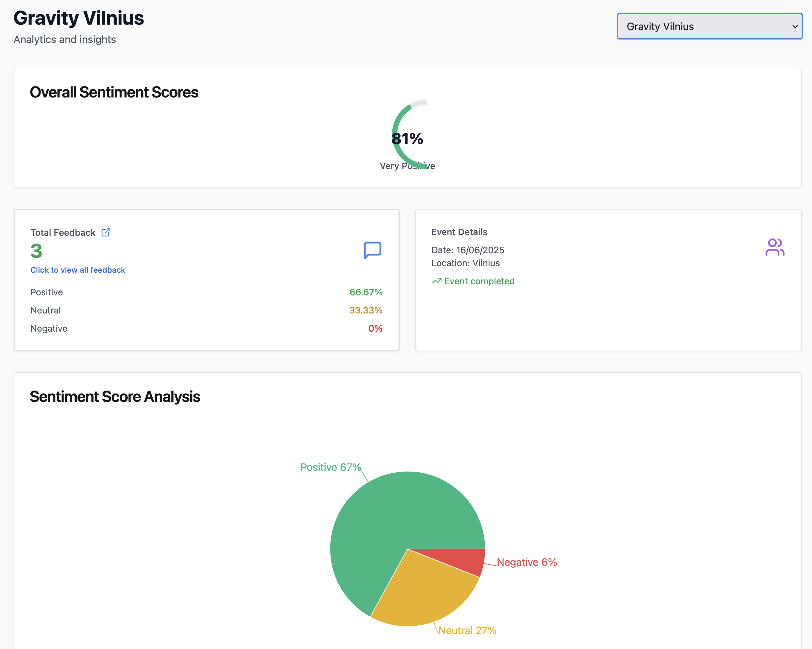

# EventSync

EventSync is a backend application that helps teams organize events and automatically analyzes participant feedback using AI sentiment analysis.

## Overview

EventSync is a platform designed to streamline event management for teams organizing workshops, team buildings, or small conferences. The application allows event organizers to create and manage events, while participants can submit feedback after attending. What sets EventSync apart is its integration with AI sentiment analysis, which automatically classifies feedback as positive, neutral, or negative, providing organizers with valuable insights about event reception.

## System Architecture

```
┌─────────────┐     ┌─────────────┐     ┌─────────────────────┐
│             │     │             │     │                     │
│  REST API   │────▶│  Services   │────▶│  Sentiment Analysis │
│  Endpoints  │     │             │     │  API (Hugging Face) │
│             │     │             │     │                     │
└─────────────┘     └──────┬──────┘     └─────────────────────┘
                           │
                           ▼
                    ┌─────────────┐
                    │             │
                    │  H2 Database│
                    │             │
                    └─────────────┘
```

## Features

- Create and view events with title, description, date, and location
- Submit feedback for specific events
- Automatic sentiment analysis of feedback using Hugging Face API
- View feedback count and sentiment summary per event
- RESTful API with Swagger documentation

## Sentiment Analysis Dashboard



### How Sentiment Analysis Works

The dashboard displays three key metrics:

1. **Overall Sentiment Score**: Calculated by combining all positive and negative scores from sentiment analysis, not just the dominant sentiment. The formula is:
   ```
   overallAverageScore = (averageOfPositiveScores - averageOfNegativeScores + 100) / 2
   ```
   This normalizes the score to a 0-100 scale where higher values indicate more positive sentiment.

2. **Total Feedback by Sentiment**: Shows the count of feedback items categorized by their dominant sentiment (positive, negative, neutral) with percentage equivalents below.

3. **Sentiment Score Analysis**: Displays the sum of all sentiment scores across all feedback. This approach ensures that all sentiment nuances are captured - for example, if a feedback is classified as positive with a score of 0.51 but also has a negative score of 0.49, both values contribute to the overall analysis.


## Access the Application

The EventSync application is already deployed and ready to use. No installation or setup is required.

Simply visit the following URL to access the application:

**[remycommits-337869308.us-east-1.elb.amazonaws.com](http://remycommits-337869308.us-east-1.elb.amazonaws.com)**

OpenAPI Documentation: **[remycommits-337869308.us-east-1.elb.amazonaws.com/swagger-ui/index.html](http://remycommits-337869308.us-east-1.elb.amazonaws.com/swagger-ui/index.html)**

## Developer Guide

### Technology Stack

<div align="center">
  <p>
    
    
    
  </p>
  <p>
    
    
    
    
  </p>
</div>

### Project Structure

- `controllers`: REST API endpoints
- `model`: Data models (Event, Feedback, SentimentAnalysis)
- `service`: Business logic and external API integration
- `data`: Repository interfaces for database access

### API Endpoints

- `POST /api/events`: Create a new event
- `GET /api/events`: List all events
- `POST /api/events/{eventId}/feedback`: Submit feedback for an event
- `GET /api/events/{eventId}/summary`: Get sentiment breakdown for an event
- `GET /api/events/feedback`: Get all feedback
- `GET /api/events/summary`: Get sentiment summary for all events

### Development Setup

### Docker

You can pull the pre-built Docker image for EventSync:
```
docker pull remy979/eventsync:latest
```

### Prerequisites

- Java 17 or higher
- Maven 3.6 or higher
- Hugging Face API token


1. Clone the repository:
   ```
   git clone https://github.com/yourusername/EventSync.git
   cd EventSync
   ```

2. Import the project into your IDE (IntelliJ IDEA, Eclipse, etc.)

3. Set up the environment variable for the Hugging Face API token:
   ```
   export TOKEN=your_hugging_face_api_token
   ```

4. Run the application from your IDE or using Maven:
   ```
   mvn spring-boot:run
   ```

5. Access the application:
   - UI: http://localhost:8080
   - API: http://localhost:8080/api/events
   - Swagger UI: http://localhost:8080/swagger-ui.html
   - H2 Console: http://localhost:8080/h2-console (JDBC URL: jdbc:h2:mem:testdb)

6. Run tests:
   ```
   mvn test
   ```


## Future Features

We are continuously working to enhance EventSync with more advanced AI capabilities. Upcoming features include:

- **Advanced Sentiment Analysis**: More sophisticated AI models to provide deeper insights into feedback sentiment
- **Trend Analysis**: AI-powered tracking of sentiment trends over time to identify patterns
- **Feedback Categorization**: Automatic categorization of feedback topics to help organizers focus on specific areas
- **Personalized Recommendations**: AI-generated suggestions for event improvements based on feedback analysis
- **Real-time Analytics Dashboard**: Live updates of sentiment metrics during events

These enhancements will allow event organizers to receive more detailed and actionable analytics, enabling them to create better, more engaging events based on participant feedback.

## Contact

[ephraim.gibson@vvk.lt]
